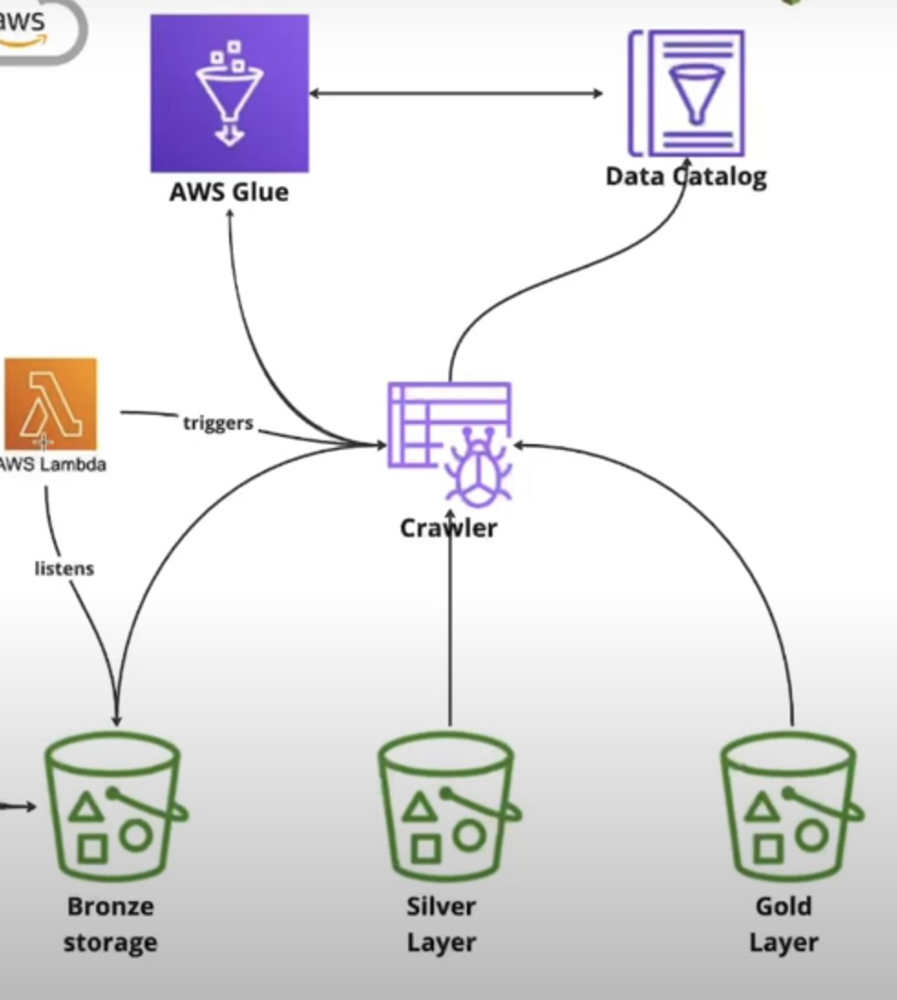

## AWS Glue

- Purpose: AWS Glue is a managed ETL service that allows you to prepare and transform data for analytics. It works with the Data Catalog and Crawler to manage metadata and automate the ETL process.
- Role : AWS Glue orchestrates the overall ETL process, triggering the Crawler to update the Data Catalog with metadata about the datasets stored in the S3 buckets.

## Data catalog

- Purpose: The AWS Glue Data Catalog stores metadata (e.g., table definitions, schema) about datasets, making them accessible and understandable to the ETL process.

- Role: The Data Catalog holds the metadata created by the Crawler. This metadata is then used by AWS Glue to perform ETL jobs and query the data.

## Lmabda

-Purpose: AWS Lambda is a serverless compute service that allows you to run code in response to events without provisioning or managing servers.

-Role : AWS Lambda listens for events, such as the arrival of new data in the Bronze storage bucket. When new data is detected, it triggers the Crawler to scan the data and update the Data Catalog.

## Crawler

- Purpose: The AWS Glue Crawler is used to automatically infer the schema and store metadata in the Data Catalog.

- Role : The Crawler scans the contents of the buckets (Bronze, Silver, Gold) and updates the Data Catalog with the necessary metadata so that the data is searchable and usable by other AWS services.

## Why 3 buckets

#### Bronze Storage:

- Role: This bucket holds raw, unprocessed data as it is ingested from various sources. The data is typically stored here as-is without any cleaning or transformation.

#### Silver Layer:

- Role: This bucket contains data that has undergone initial cleaning and transformation. The data is usually structured and may be enriched or filtered compared to the Bronze layer.

#### Gold Layer:

- Role: This bucket stores fully processed and refined data that is ready for analysis or querying. The data here is of the highest quality and can be directly used for business intelligence and reporting purposes.

## Steps

#### (01) Create a s3 bucket . Inside that create a folder called taxi_project/ and then inside that folder upload our parquet file

#### (02) Go to AWS Glue -> Databases -> Add database

#### (03) Go to AWS Glue -> Crawlers -> create a crawler -> Add data source -> click on browse and select the folder that we created inside s3 bucket . Then click on next . Then create a new IAM role , then again click on next and select the db that we created as the traget database . Select the Frequency accordingly . After that create the crawler .

#### (04) Now go to aws lambda -> create a new function -> once we create it go inside that -> go to configurations -> permissions -> click on Role name -> Add permissions -> and now attach following policies

- AmasonS3FullAccess
- WSGlueConsoleFullAccess

- Also go back to the configuration -> Edit -> now increase the timeout

#### (05) Now go to that aws lmabda function we created and put the following as the code

```python
import json
import boto3

# initialize aws clients
glue = boto3.client('glue')
s3 = boto2.client('s3')

def lambda_handler(event,context):
       # get the bucket name and file key from  the s3 event
       bucket_name = event['Records'][0]['s3']['bucket']['name']
       file_key = event['Records'][0]['s3']['object']['key']

       # specify the glue crawler name
       crawler_name = 'taxi_crawler'

       # start the glue crawler
       try:
              response = glue.start_crawler(Name=crawler_name)
              print(f'Glue crawler {crawler_name} started successfully')
       except Exception as e:
              print(f'Error starting Glue crawler {crawler_name}:{e}')
              raise e

```

#### (06) Now go to that aws lmabda function we created and go to triggers and click on add triggers .

- S3
- Select our s3 bucket that we have created
- Event type : All object create event
- prefix : taxi_project/ ## because we have created a folder inside ouer s3
