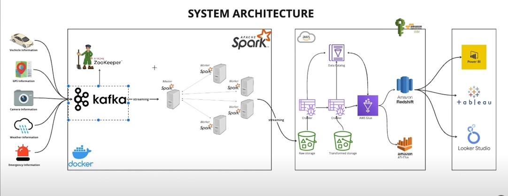

#### First create the docker-compose.yml and then create the main.py . Inside that we configure our kafka . After that create spark-city.py file and we use that file for spark taks

```
pip install -r requirements.txt

docker compose up -d

python jobs/main.py

```

### Now go to the docker desktop and click on the broker container and click on Exec

```
kafka-topics --list --bootstrap-server broker:29092

kafka-sonsole-consumer --topic vehicle_data --bootstrap-server broker:9092 --from-begining
```

### Now go to aws and create a s3 bucket called spark-streaming-data . Go to the permissions of the created bucket and confirm that Block all public access: off . So our bucket is publicly accessible . After that go to IAM and create a user with following policies . (But we can proceed without doing it as well. Then we will be using the root user. If we create a one go to that created user -> Security Credentials -> create access key : by doing so we can get the access key and secret key of the user )

- AdmininstratorAccess
- AmazonS3FullAccess
- AWSGlueConsoleFullAccess
- IAMUserChangePassword

#### Open up the docker desktop and go to containers . Click on the URL of spark-master-1 . There we can access our spark master UI . (localhost:9090)

#### Now crete the spark-cit.py . Once we are done with that , go to docker desktop -> containers -> broker -> click on Exec

```
kafka-topics --delete --topic emergency_data --bootstrap-server broker:29092
kafka-topics --delete --topic gps_data --bootstrap-server broker:29092
kafka-topics --delete --topic traffic_data --bootstrap-server broker:29092
kafka-topics --delete --topic vehicle_data --bootstrap-server broker:29092
kafka-topics --delete --topic weather_data --bootstrap-server broker:29092

```

#### Now open up a terminal in vscode

```
docker exec -it project-03-spark-master-1 spark-submit \
--master spark://spark-master:7011 \
--packages org.apache.spark:spark-sql-kafka-0-10_2.12:3.5.0,org.apache.hadoop-aws:3.3.1,com.amazonaws:aws-java-sdk:1.11.469 jobs/spark-city.py
```

#### Now we have to create an AWS Glue crawler . So go to aws -> AWS Glue -> Data catalog -> Crawlers -> Create a crawler -> as the source select our s3 bucket . So the S3 path should be s3://spark-streaming-data/data/ , where spark-streaming-data is the name of our s3 bucket. Create a new new IAM role for that as well . We also have to give a db as well . If we dont have a one we have to create a one . Then create the crawler and once it is created run the crawler . Then under catalog -> Databases -> Tables we can see our tables getting created .

#### Now search for Athena and then go inside that . Inside that in the left pane we can see our tables . There we can run any kind of SQL query and play around with our tables .

### To load the data into Redshift :

- Go to AWS console and search for redshift and click on that -> create cluster -> select the number of nodes based on the requirement. For this we have to create a new IAM role with AmazonS3ReadOnlyAccess . Once it gets created click on that and go inside and then copy the JDBC URL .Then we can open DBeaver and select redshift and then click on URL and paste that URL that we copied inside that . username: awsuser
