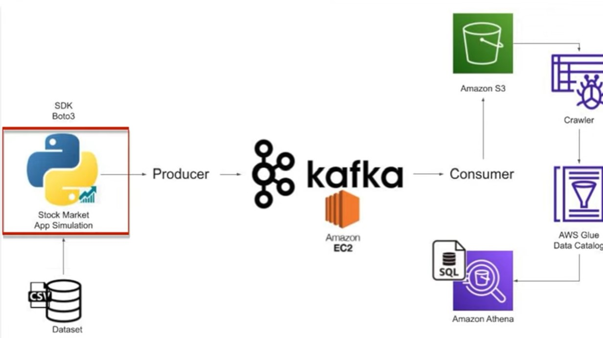

### First create an EC2 instance in aws (once we are created it goto the EC2 -> click on security -> security groups ->edit inbound rules -> allow all traffic anywhere IPV4) , and connect with that using the mobaxterm. Then run the following commands

```
wget https://downloads.apache.org/kafka/3.3.1/kafka_2.12-3.3.1.tgz
tar -xvf kafka_2.12-3.3.1.tgz

java -version
sudo yum install java-1.8.0-openjdk
java -version
cd kafka_2.12-3.3.1

```

### Start Zoo-keeper:

```
bin/zookeeper-server-start.sh config/zookeeper.properties
```

### Open another window to start kafka But first ssh to to your ec2 machine as done above

### Start Kafka-server (Duplicate the session & enter in a new console)

```
export KAFKA_HEAP_OPTS="-Xmx256M -Xms128M"
cd kafka_2.12-3.3.1
bin/kafka-server-start.sh config/server.properties
```

### It is pointing to private server , change server.properties so that it can run in public IPTo do this , you can follow any of the 2 approaches shared below

- Do a "sudo nano config/server.properties" - change
- ADVERTISED_LISTENERS = PLAINTEXT://<public ip of Ec2>:9092

### Create the topic (Duplicate the session & enter in a new console )

```
cd kafka_2.12-3.3.1
bin/kafka-topics.sh --create --topic demo_testing2 --bootstrap-server <Put the Public IP of  EC2 Instance>:9092 --replication-factor 1 --partitions 1
```

### Start Producer:

```
bin/kafka-console-producer.sh --topic demo_testing2 --bootstrap-server<Put the Public IP of  EC2 Instance>:9092
```

### Start Consumer (Duplicate the session & enter in a new console )

```
cd kafka_2.12-3.3.1
bin/kafka-console-consumer.sh --topic demo_testing2 --bootstrap-server <Put the Public IP of  EC2 Instance>:9092

```

### After that create a s3 bucket called 'kafka-stock-market-tutorial' . After that go to IAM -> Users -> add users -> Attach AdmininstratorAccess policy for that . And make sure to download the credentials csv file .

### Now open up a terminal in vs code

```
aws configure
```

- Give the credentials

### Now go to aws -> aws glue -> data catalog -> crawler -> create crawler ->

- Data source : s3
- s3 path : s3://kafka-stock-market-tutorial/

### Now click on next , next and then we have to attach an IAM role for this .(But first we need to create a one . So create an IAM role , select the use case as Glue , and attach the AdministratorAccess policy to this .) After that click on Add database and just give it a name and click on create database. Now click on next and next , then we are done with creating the crawler . Now click on our crawler and click on Run.
