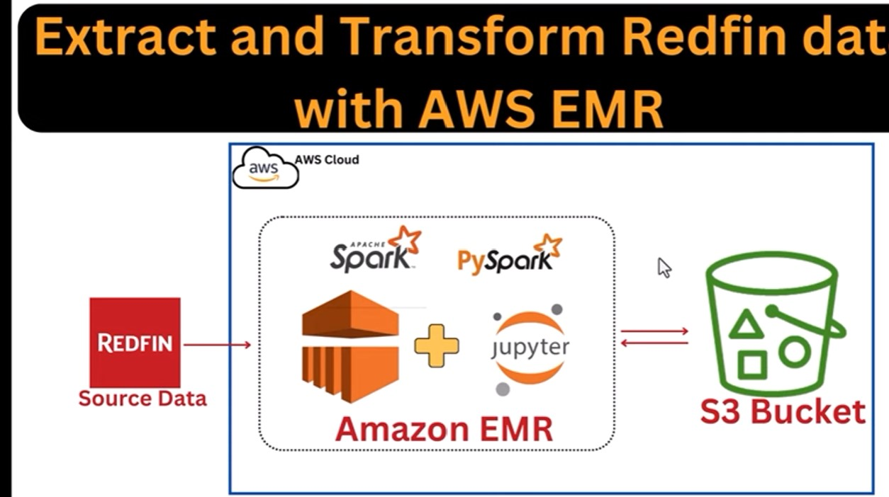
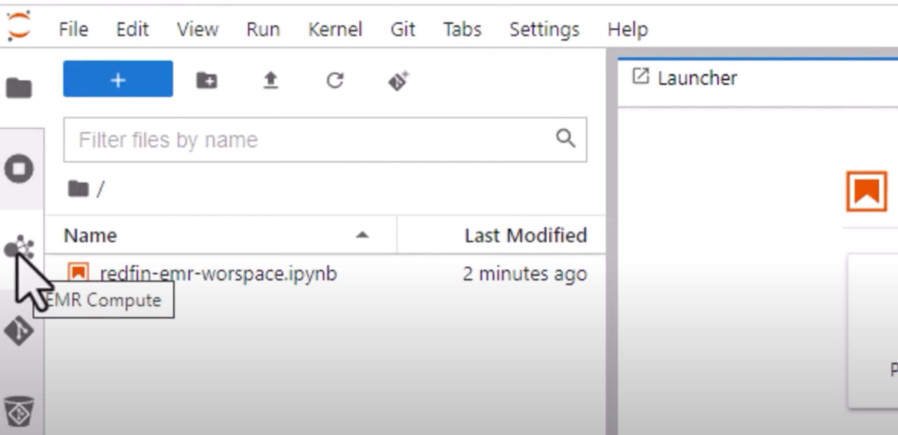

## What is AWS EMR ?

- Amazon EMR (Elastic MapReduce) is a cloud-based big data platform provided by Amazon Web Services (AWS). It allows you to process and analyze large datasets quickly and cost-effectively by automatically provisioning and managing clusters of compute instances running big data frameworks such as Apache Hadoop, Apache Spark, Apache HBase, Apache Flink, and others.

### Now goto aws -> IAM -> Users -> create user -> then select I want to create an IAM user -> custom password and give it a password and untick that 'Users must create a new password ..." -> click on attach policies directly and attach AdministratorAccess , click on next , click on create user . Dont forget to donwload the credentials csv file . After that goto that created user -> security credentials -> create access key and select Command Line Interface and create the key . Store them somewhere else safely . Now sign out from the aws root account and sign in with the user details that we created

### Now create a s3 bucket (name: store-raw-data-yml)

### Create another bucket (name: redfin-transform-zone-yml)

### Now search VPC -> create VPC

- Number of public subnets : 2
- Number of private subnets : 0
- VPC endpoint : s3 gateway

### Now search for EMR -> create cluster -> Application bundle , put ticks on spark and also put a tick on JupyterEnterpriseGateway . Remove the task node . Select 'Use EMR-managed scaling' . Pick minimum cluster size : 3 , so we have one master and 2 workers.

- Maximum core nodes in the cluster: 8
- Maximum on demand instances in the clsuter : 8
- Instance(s) size : 2
- select the VPC that we created
- Also generate Amazon EC2 key pair for SSH to the cluster
- ut a tick on Create a service roles and under that security group , select the VPC that we created
- Put a tick on Create an isntance profile , and put a tick to All s3 buckets in this ...
- Now click on create cluster

### Now go the EMR we created . Then in the left hand side under EMR studio ->Studios -> Create studio -> select the VPC we created . For subnets select both the subnets . Put a tick on Default security group . We also have to select the IAM role that we created. Now we have to create a s3 bucket called emr-studio-bucket-yml . Now as the workspace location select the bucket we just created . Now click on create studio . (Here make sure that the role we attach has adminaccess as well as Amazons3FullAccess)

### Now go to the studio that we created and click on it's access URL. Now click on create workspace Now in the input box under S3 location there is a bucket name . That's where our jupyter notebook wil be created . Now click on create workspace . Now click on the workspace we created . It will open up the jupyter notebook.

### Now click on that icon -> Choose the EMR cluster we created -> click on attach . Now double click on that notebook name in the left handside and select Pyspark as the cluster . That notebook is given in the folder
