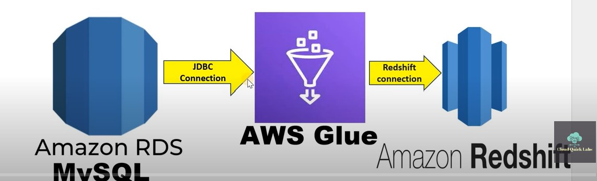

## Frist we gonnna have to create a RDS . Goto aws -> RDS ->

- Engine type : MySql
- Templates : Dev/Test
- public access : yes
- Now go inside the db we created and copy the public Ip . Now copy that and open up mysql workbench nad click on Mysql Connection + mark , and give it a name and for the Hotname paste that ip we copied and also provide the username and the password of the db we created in the RDS . Port :3306 .

## Now go to aws -> Amazon Redshift -> Serverless dashboard -> create workgroup ->

- give it a name and a name for namespace
- Database name and password : put a tick on Customize admin user credentials -> Admin user name : admin -> click on manually add the admin password and give it a password .
- Here we also need to provide an IAM role . So create an IAM role with Administratoraccess and attach that role to redshift
- What it is created click on that -> query database -> Inside that under dev / public/tables create a table ( give the following command and click on run )

```sql
create table cloudquicklabrdstbl(
       industry_name_ansic varchar(100) not null,
       rme_size_grp        varchar(100) not null,
       variables           varchar(100) not null
)


```

### To work with that

```sql

SELECT * FROM "dev"."public"."cloudquicklabrdstbl"
```

## Now go to AWS Glue -> Data integration and ETL -> ETL jobs -> click on Visual ETL

- As the source select Relational DB . Now click on that -> Just give it a name and click on create connection and pick the rds we created. As the target select the amazon redshift and configure that . (Handling of data and target table : MERGE data into target table | put a tick on keys and simple actions | Under matching keys select all of the varaibles )
- Give the name of the table we created as the table name
- click on save
