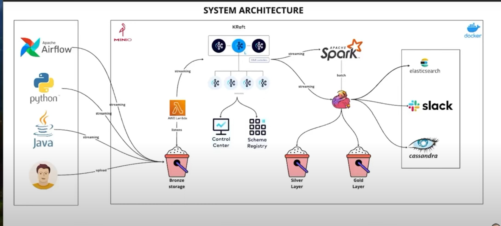

### Kraft and ZooKeeper serve different purposes in the Kafka ecosystem:

- ZooKeeper: Traditionally used by Apache Kafka for managing distributed brokers, leader election, and configuration. It's a centralized service for maintaining configuration information and providing distributed synchronization.
  Kraft: Stands for Kafka Raft Metadata Mode. It's a newer, built-in mode for Kafka that aims to eliminate the need for ZooKeeper. Kraft uses the Raft consensus algorithm to manage metadata and ensure fault tolerance, simplifying the Kafka architecture by removing ZooKeeper as a dependency.

### MinIO is an open-source object storage server that's compatible with Amazon S3. It's designed to provide high-performance, scalable storage for a wide range of use cases, including data lakes, application storage, and backup solutions. Here are some key features and aspects of MinIO:

- S3 Compatibility: MinIO implements the Amazon S3 API, which means it can be used as a drop-in replacement for S3 in applications that interact with S3-compatible storage. This makes it easy to integrate with existing tools and libraries designed for S3.
  High Performance: MinIO is built to handle large amounts of data efficiently. It’s optimized for high throughput and low latency, making it suitable for applications requiring fast and reliable object storage.
  Scalability: MinIO supports both single-node and distributed deployments. In a distributed setup, it can scale out horizontally by adding more nodes, providing increased capacity and redundancy.

## Steps

(01) Create the docker-componse.yml and run the following command

```
docker compose up -d
```

- To get the confluent UI -> localhost:9021

(02) Go to the minio UI -> Access keys -> create access keys and then put them inside the minio_config.py

(03) Then create producer.py . Here we have to create a bucket in minio and put the data file inside that

(04) Once we done with the producer.py goto the minio UI -> Events -> events destination -> select kafka

- identifier : any name
- brokers : broker1:29092,broker2:29092
- topic: nyc_trip_records

- Now go to confluent UI -> Topics -> create topic and name it as 'nyc_trip_records' . But we dont have to do this manually.

(05) Now go back to minio UI -> Buckets -> select the bucket that we created -> Subscribe to event
ARN : arn:minio:sqs::taxi_trip_sink:kafka
select Event : PUT

(06) Now go to the docker desktop and go to the broker1 and click on Exec

```
kafka-topics --list --bootstrap-server broker1:29092


kafka-console-consumer --topic nyc_trip_records --bootstrap-server broker1:29092 --from-begining
```
