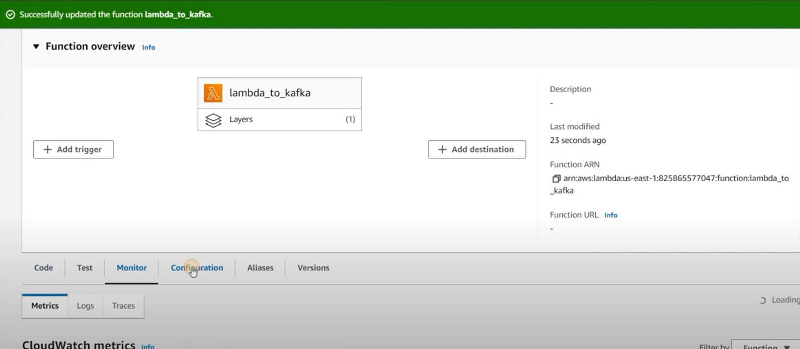

# Serverless Apache kafka Publisher Using AWS Lambda

### Now lets see how send data to AWS MSK topic from AWS lambda using python


### Sometimes when the large amount of data flows in , aws lmabda coudnt handle it well , so in that kind of scenarios we use AWS SQS for load balancing , so lambda can process at it own phase

### Before runing the MSK cluster we need to do some network configurations . Because MSK cluster will run in different different subnets . For higher availability we gonna use atleast 2 subnets and 2 brokers will be running .


## Step 1

- Cretae VPC -- Name -- virtual-private-cloud IPv4 CIDR -- 10.0.0.0/16
- Host address range -- 10.0.0.1 - 10.0.255.254

## Step 2

- Create 2 public subnets
- Public-Subnet-A--10.0.0.0/24
- Host address range -- 10.0.0.1 - 10.0.0.254
- Public-Subnet-B--10.0.1.0/24
- Host address range -- 10.0.1.1 - 10.0.1.254

## Step 3 ( Here we dont have to do anything , just to see )

- Check the default route table -- you will see the above 2 subnets have not been explicitly associated with any route tables and are therefore associated with the main route table.

## Step 4 ( Go to Internet Gateways and click on create gateway)

- Name : myigw and then click on create gate way . Now go to that gateway we created and click on Actions and then select Attach to VPC . There select the vpc that we have created .
- Now go to Route tables and then select the one for our VPC that we created -> select Routes and then click on Edit routes
- Destination : 0.0.0.0/0
- Target : igw- ( Here select our igw we created )

## Step 6

- Launch MSK Cluster just give it a name and select Provisioned as the cluster type , Broker type : kafka.t3.small , Number of zones :2 , Amazon EBS Storage per broker : 1 GB , select vpc we created , now select the 2 subnets we created with their zones , unauthorised access allowed , plaintext enxryption (keep security group as it is)

## Step 7: ( Now lets launch an EC2 in the same VPC so it can communicat with our MSK cluster)

- Launch Linux EC2 , here select the vpc that we created and select the subnet B ,In the list Auto-assign Public IP choose Enable.. Once we created the EC2 , click on that and go to security groups - > edit inbound rules
- Type: All traffic
- source : This must be the security group of our MSK cluster
- Type : All traffic
- source : anywher ipv4
- Now go to the MCK cluster and go to security groups -> edit inbound rules
- Type : All traffic
- source : security group of our Ec2

#### Now connect to our EC2 using mobaxterm (here when we installing kafka , we have to make sure we are downloading the same kafka version that we specified when we creating the MSK cluster )

```
sudo yum install java-1.8.0-openjdk
wget https://archive.apache.org/dist/kafka/2.8.1/kafka_2.12-2.8.1.tgz
tar -xvf kafka_2.12-2.8.1.tgz
```

#### Creating Kafka Topic: ( Open up a seperate MobaXterm window )

```
cd kafka_2.12-2.8.1
```

#### To get the URL for our MCK cluster -> go to MCK cluster - > View client information ->under private endpoint we can see the 2 URLs . Select the one with respect to the plain text

```
bin/kafka-topics.sh --create --topic {topic_name} --bootstrap-server {Put the MSK bootstrap server URLs here} --replication-factor 1 --partitions 1
```

#### Start Console Consumer: ( Open up a seperate MobaXterm window )

```
cd kafka_2.12-2.8.1

bin/kafka-console-consumer.sh --topic {Topic Name} --bootstrap-server {Put the MSK bootstrap server URLs here}

 pip3 install kafka-python
```

### Producer Code:

```python
from time import sleep
from json import dumps
from kafka import KafkaProducer

topic_name='{Topic Name}'
producer = KafkaProducer(bootstrap_servers=['{Put 1st MSK bootstrap server URL here}','{Put 2nd MSK bootstrap server URL here}'],value_serializer=lambda x: dumps(x).encode('utf-8'))

for e in range(1000):
data = {'number' : e}
print(data)
producer.send(topic_name, value=data)
sleep(1)

```


### Now we gonna run that python code in a lambda layer . To locally set up that we need WSL in our local system . Then run the following commands to create the Lambda Layer ( We can also run that in an EC2 as well )

```
       sudo apt-get update
       sudo apt install python3-virtualenv
       virtualenv kafka_yt
       source kafka_yt/bin/activate
       python3 --version
       sudo apt install python3-pip
       python3 -m pip install --upgrade pip
       mkdir -p lambda_layers/python/lib/python3.8/site-packages
       cd lambda_layers/python/lib/python3.8/site-packages
       pip install  kafka-python -t .
       cd /mnt/c/Users/USER/lambda_layers
       sudo apt install zip
       zip -r kafka_yt_demo.zip *
```

#### Now create a s3 bucket and then upload the zip file in to the bucket . Now go to the s3 bucket and copy the s3 URL , now go to aws lambda -> layers

- Name : kafka \_yt_demo_lambda
- Upload a file from Amazon s3
- Amazon s3 URL : paste that URL we copied
- compatible run time : python 3.8
- Now click on create

#### Now go to functions


#### Go to functions -> create a function

- Function name : lambda_to_kafka
- Runtime : python 3.8

#### now click on create function . Put that python code in their anc click on deploy


#### Now go to layers -> add layers ->


#### Now go to layers -> add layers -> select specify an ARN and copy the arn in kafka_yt_demo_lambda we created and paste it in there and click on add.

#### Now go to Configuration



#### Now go to Configuration -> Permissions -> click on the link below the Role name and then click on permissions and then click on Add permissions and then select AmazonVPCFullAccess

#### Now go to VPC under configuration


#### There select the same VPC where our MSK cluster is running . And also select the security group that our MSk is having


#### Here click on deploy . Here we didnt set any triggers . So we can manually do it by clicking that deploy whenver we want . So that lambda code can publish the message in MSk cluster
